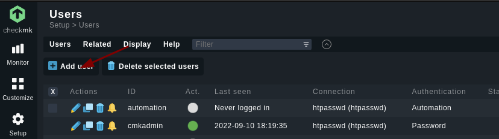
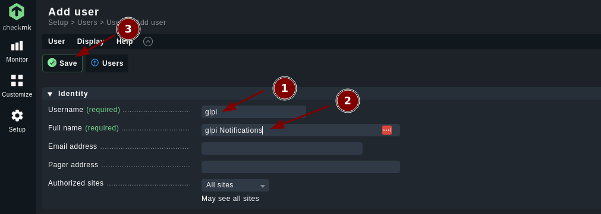
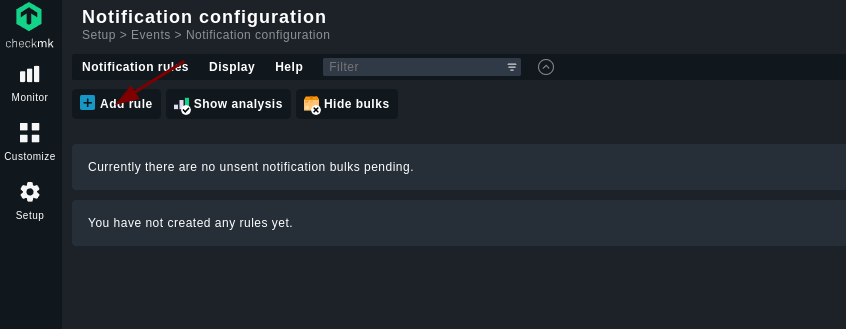
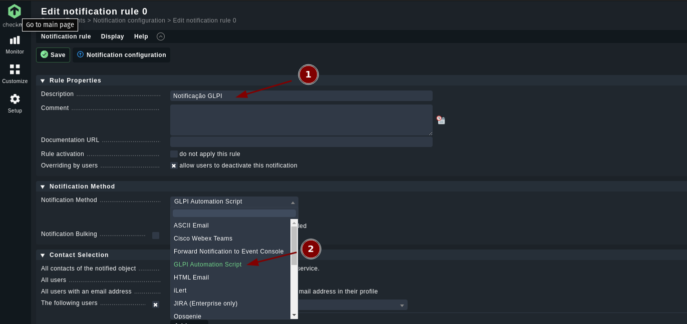
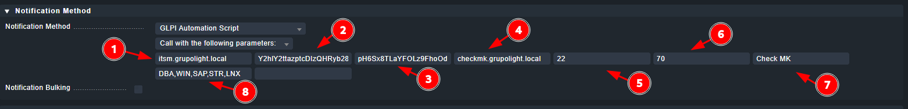
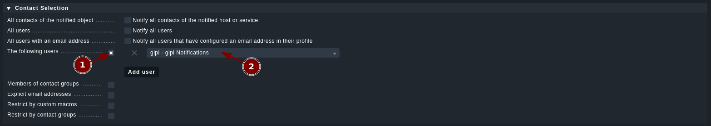
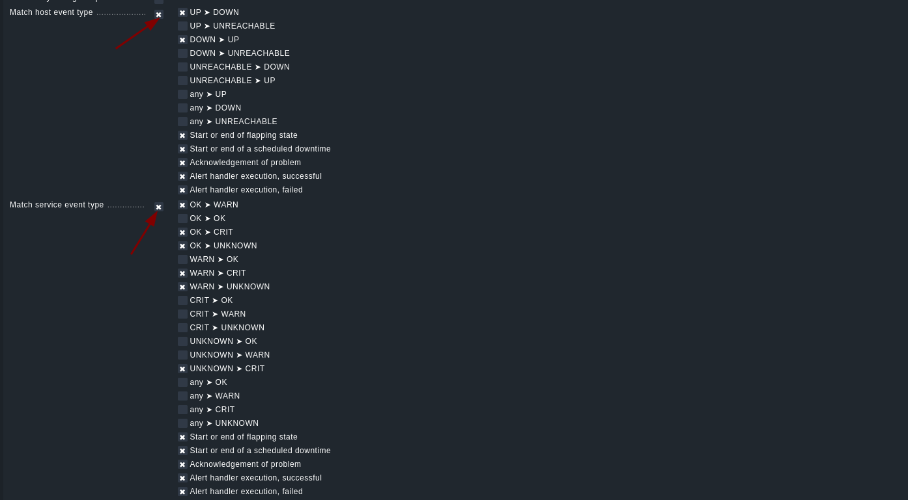

# Automação de chamados do CheckMK para GLPI
### Introdução

Script desenvolvido para o CheckMK que possibilita a abertura e o fechamento automático de chamados no GLPI(testado nas versões 9 e 10).

### Requisitos

- [jq](https://stedolan.github.io/jq/manual/) versão >= **jq-1.6** 
- [curl](https://www.mit.edu/afs.new/sipb/user/ssen/src/curl-7.11.1/docs/curl.html) versão >= **curl 7.81.0** 


## Instalação

Fazer o login no usuário do CheckMK
```
omd su mysite
```
Entre no diretório `notifications/`
```
cd ~/local/share/check_mk/notifications/
```
Baixe o script 
```
wget --no-check-certificate https://raw.githubusercontent.com/Minsait-Brasil/checkmk-glpi-notify/main/check_mk_glpi_notify.sh -O check_mk_glpi_notify
```

Dê as permissões de execução para o script
```
chmod +x check_mk_glpi-notify
```

## Configuração necessaria no CheckMK 

#### Requisitos:
 1 - Criar um usúario para o glpi
 2 - Criar regra de notificação

**Observação**: Check_MK versão >= 2.0.0


#### 1. Adicionando o usuário

```
Setup → Users
```






#### 2. Adicionando regra de notificação

```
Setup → Events → Notifications
```



##### 2.1 Configuração regra de Notificação


1. Adicionar a descrição do  regra
2. Selecione o Script

##### 2.2 Configuração dos parametros do script


- [Documentação do GLPI](https://travessia.glpibrasil.com.br/apirest.php)

1. Url do glpi(sem protocolo)
2. Token do usuario do glpi
3. Token da api do glpi
4. url do CheckMK(sem protocolo)
5. ID do grupo no glpi que o chamado será atribuido em sua criação
6. ID do usuário no glpi que o chamado será atribuido em sua criação
7. Tag de ambiente
8. Tags de Fila
    - obs: separar as fila por **`,`**

##### 2.3 Configurar o usuario 

1. Marca
2. Selecione o usuario

##### 2.4 Configurar o usuario 

